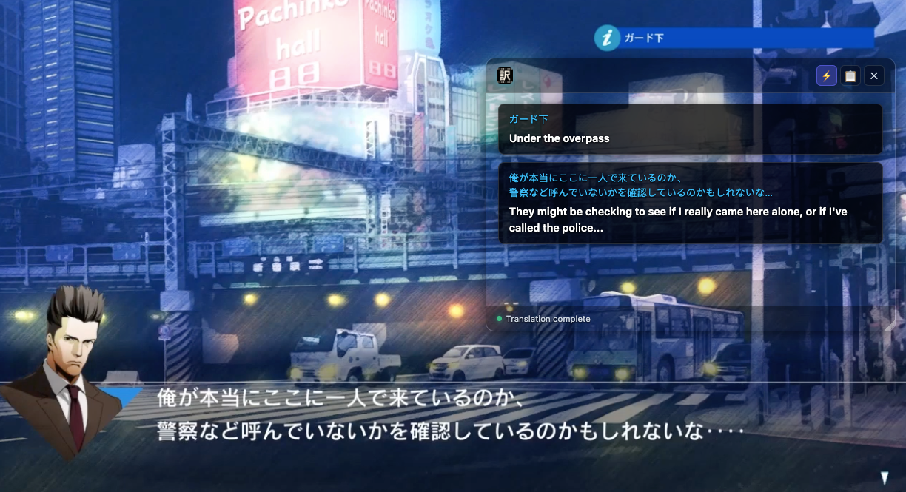
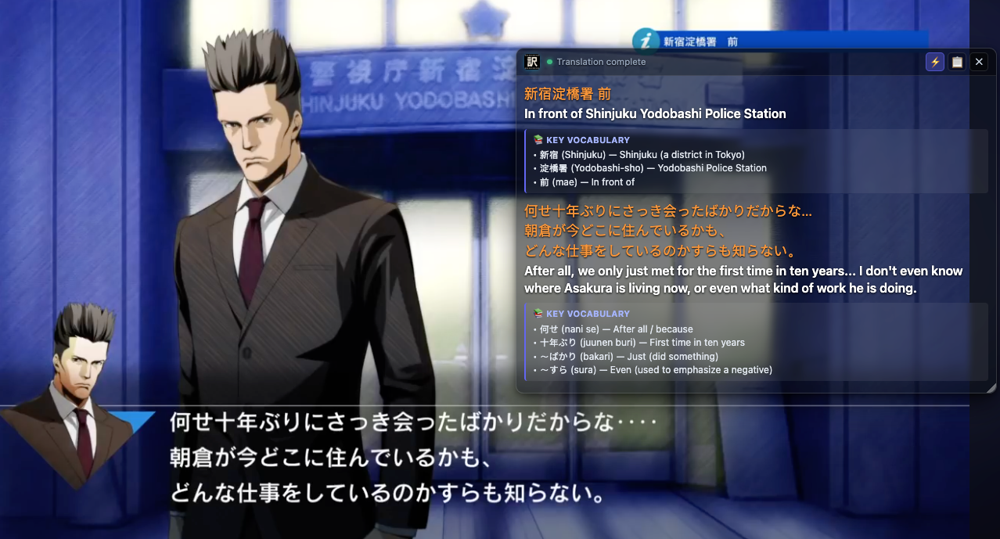
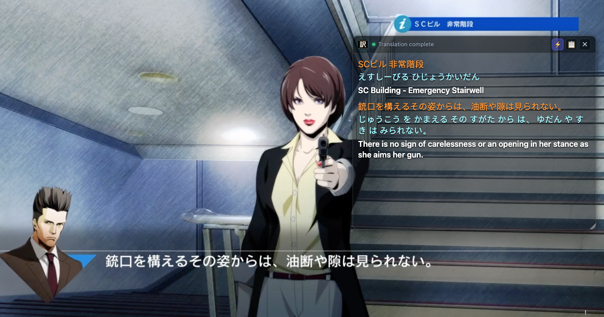
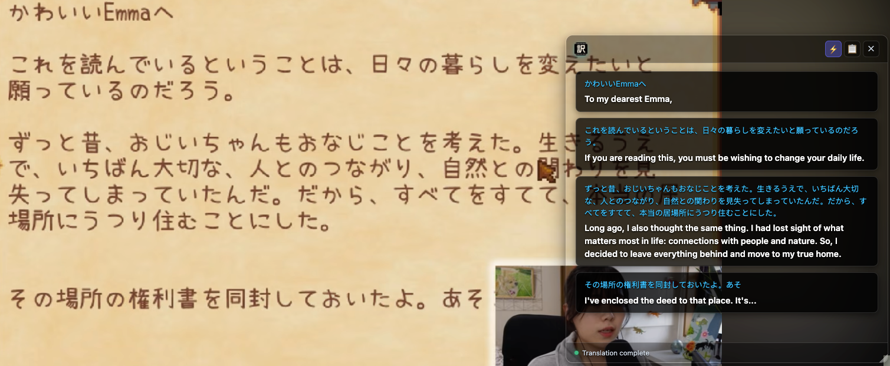
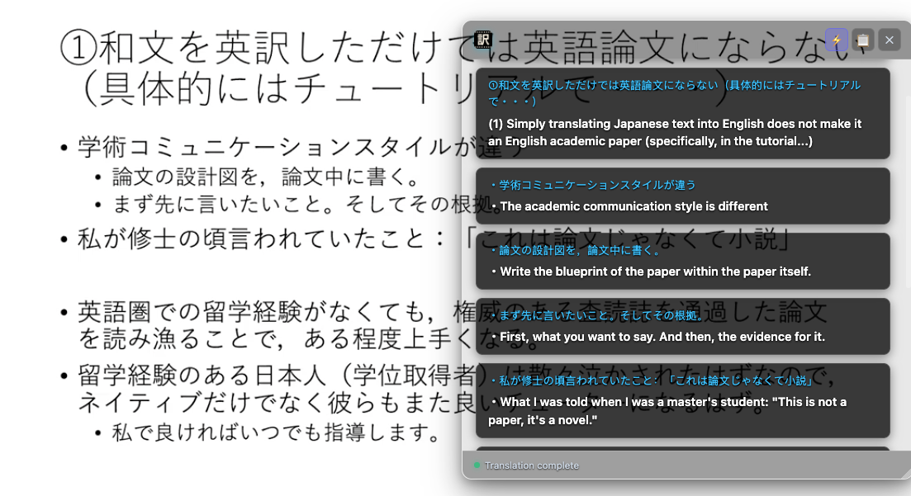

<div align="center">
  
  <h1>Tranz Video</h1>
  <p><strong>Translate on-screen text, game dialogue, and visual text from any web video.</strong></p>
  <p>
    <a href="https://developer.chrome.com/docs/extensions/mv3/intro/"></a>
    <a href="LICENSE"></a>
    <a href="https://www.google.com/chrome/"></a>
  </p>
</div>

**Tranz Video** is a Google Chrome extension that lets you translate any text you see inside a video.

While regular subtitle extensions only work when a video has uploaded subtitle files, Tranz Video reads the words directly from the video itself. This lets you translate game dialogues, hardcoded subtitles, on-screen signs, and presentation slides on any website.

---

## Why Tranz Video?

Standard subtitle tools cannot read text that is built into the video itself:

- **Game Dialogues & Walkthroughs:** Translate dialogue boxes, skill descriptions, quest text, and in-game menus.
- **Foreign Shows & Anime:** Read hardcoded subtitles, signs, and background text.
- **Tutorials & Lectures:** Translate slides, code, diagrams, and foreign presentations.

Whenever you see text you want to read, simply pause the video and click **Translate** to see the translation in a floating window.

---

## Game Translation & Walkthroughs

Translating foreign video games has always been notoriously difficult because dialogue boxes, quest logs, choice prompts, item descriptions, and skill menus are baked directly into video frames with no subtitle files available.

**Tranz Video** turns any foreign gameplay video, stream, or visual novel into an interactive language-learning experience:

| RPG Dialogue Transcription | In-Game Menus & Prompts | Furigana & Vocabulary Cards |
| :---: | :---: | :---: |
|  |  |  |

- **RPG & Visual Novel Dialogue:** Transcribe stylized Japanese, Korean, or Chinese dialogue boxes and on-screen story text.
- **Japanese Furigana Mode:** Automatically generate Hiragana reading pronunciation for complex Kanji names, locations, and lore terms.
- **Vocabulary Breakdown:** Extract game-specific item names, verbs, and idioms into an integrated glossary card below each line.
- **Livestreams & Walkthroughs:** Follow along with foreign creators on YouTube Gaming, Twitch, and Bilibili without getting lost in menus.

---

## Other Use Cases

| Video Podcasts & Foreign Shows | Presentations & Technical Slides |
| :---: | :---: |
|  |  |

---

## Features

- **AI Vision-Powered OCR & Translation:** Transcribes and translates visual text, game dialogue, on-screen signs, and lecture slides directly from video frames without requiring pre-existing subtitle tracks.
- **Dedicated Language Learning Modes:**
  - **Bilingual Pair:** Displays interleaved source text and target translations side-by-side.
  - **Japanese Furigana:** Extracts Hiragana pronunciation readings with natural word spacing for Japanese learners.
  - **Vocabulary Breakdown:** Automatically generates a concise glossary of key terms, verbs, and idioms extracted from dialogue.
  - **Target Only:** Clean, immersion-style single translation display.
- **Multiple AI Endpoints & Instant Switching:** Configure and manage multiple AI provider profiles (Local Ollama / vLLM, Google Gemini, OpenAI Direct, OpenRouter) and switch active backends on the fly directly from the toolbar popup.
- **Customizable Appearance & Themes:** Personalize your HUD with visual effects (**Frosted Glass / Glassmorphism**, **Translucent**, **Opaque**, **Glow**), customizable background opacity, and independent font size and color controls for Source (`#38BDF8`), Furigana (`#FBBF24`), and Target (`#FFFFFF`) text.
- **Tailored Prompt Orchestration:** Customize system and user prompts to adapt translations to your specific demands—tune for colloquial video slang, gaming terminology, technical jargon, or custom formatting.
- **Intelligent Video-Aware HUD:** Automatically attaches to active video streams on YouTube, Bilibili, and other web players, auto-pauses during translation, and automatically refreshes when navigating between videos.

---

## How to Install

1. Download or clone this repository to your computer:
   ```bash
   git clone https://github.com/activebook/tranz-video.git
   ```
2. In your browser, navigate to `chrome://extensions/` (works on Chrome, Edge, Brave, and other Chromium browsers).
3. Turn on the **Developer mode** switch in the top-right corner.
4. Click **Load unpacked** in the top-left corner.
5. Select the `tranz-video` folder.
6. Pin **Tranz Video** to your browser toolbar.

---

## Setup

1. Click the **Tranz Video** icon in your toolbar and open **Settings** (or right-click the icon and choose **Options**).
2. Configure your preferences across the three tabs:
   - **AI Service:** Select or add your preferred AI provider profile (**Local Ollama**, **Google Gemini**, **OpenAI Direct**, **OpenRouter**, or custom proxies). Click **Test API Connection** to verify latency.
   - **Appearance:** Choose your preferred window effect (Frosted Glass, Translucent, Opaque, Glow), adjust background opacity, and customize font sizes and colors for Source, Furigana, and Target text with real-time live preview.
   - **Translation:** Select your target language, output mode (**Bilingual Pair**, **Japanese Furigana**, **Vocabulary Breakdown**, or **Target Only**), and optionally customize system and user prompts.
3. Click **Save Settings**.

---

## How to Use

1. Open any video on YouTube, Bilibili, Netflix, or any web player.
2. Pause the video on a frame with text you want to translate.
3. Click the **⚡** button on the floating window or in the toolbar.
4. Read the translated text directly on top of the video.

---

## Supported Languages

Tranz Video can translate into:

- 🇺🇸 **English** (`en`)
- 🇨🇳 **Simplified Chinese** (`zh-Hans` / 简体中文)
- 🇭🇰 **Traditional Chinese** (`zh-Hant` / 繁體中文)
- 🇯🇵 **Japanese** (`ja` / 日本語)
- 🇰🇷 **Korean** (`ko` / 한국어)
- 🇪🇸 **Spanish** (`es` / Español)
- 🇫🇷 **French** (`fr` / Français)

The language in the video is detected automatically.

---

## Frequently Asked Questions

**Does it work in full screen?**  
Yes. The translation window follows your video into full-screen mode automatically.

**Can I use free or local AI models?**  
Yes. You can connect local AI tools like Ollama without paying for an API subscription.

**Why does the window not appear on regular websites?**  
Tranz Video stays hidden on normal web pages (like search engines or news sites) and only appears when a video is present.

---

## License

This project is licensed under the [MIT License](LICENSE).
